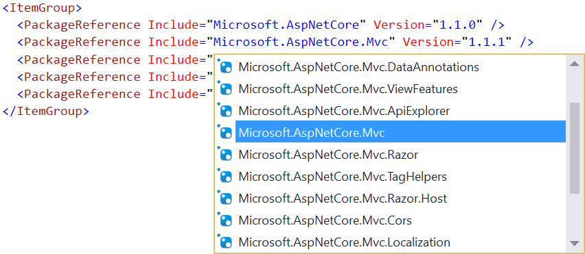
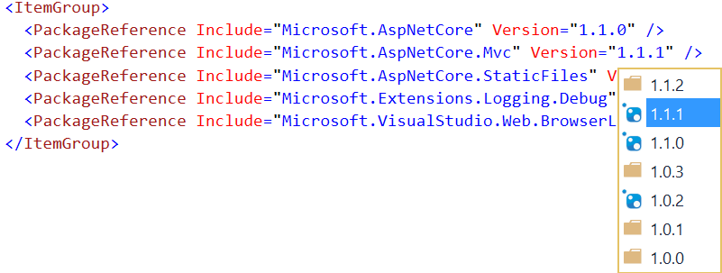
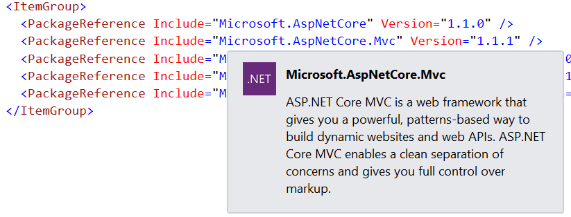
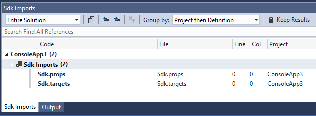
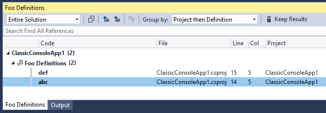

# Project File Tools

<!-- Replace this badge with your own-->
[](https://ci.appveyor.com/project/madskristensen/extensibilitytools)

<!-- Update the VS Gallery link after you upload the VSIX-->
Download this extension from the [VS Gallery](https://aka.ms/projfiletools).

---------------------------------------

Provides Intellisense and other tooling for XML based project files such as .csproj and .vbproj files.

See the [change log](CHANGELOG.md) for changes and road map.

## Features

- Intellisense for NuGet package name and version
- Hover tooltips for NuGet packages
- Go To Definition (F12) for MSBuild imports
- Go To Definition (F12) for MSBuild properties

### Intellisense
Full Intellisense for NuGet package references is provided for both packages that are locally cached as well as packages defined in any feed - local and online.





### Hover tooltips
Hovering over a package reference shows details about that package.



### Go To Definition (F12) for MSBuild imports
Set the caret on any import statement and press F12, Visual Studio will automatically open the imported file.

It supports both the traditional `Import` `Project` construct
```XML
<Import Project="foo.targets" />
```
as well as the new `SDK` attribute used by .Net Core projects:
```XML
<Project Sdk="Microsoft.NET.Sdk">
   ...
</Project>
``` 

It supports evaluation of MSBuild properties and globs.

When the import statement covers multiple files (which is typically the case with the `SDK` attribute or when using globs), it opens the a window that displays the set of files included. In that list you can:
- click on a file to open it in Visual Studio
- hover the file name and the tooltip will display the full path



### Go To Definition (F12) for MSBuild properties

Pressing F12 when caret is on the usage of a MSBuild property will open the location where that property is defined. If multiple definitions are found, it opens a window that lists all the definitions and their evaluated values.

For example:
```XML
<PropertyGroup>
    <Foo>abc</Foo>
    <Foo>def</Foo>
    <Bar>$(Foo)</Bar>
</PropertyGroup>
```
Pressing F12 on `$(Foo)` in this case will lists both places where `Foo` is defined, including the evaluated values that get set (`abc`, `def`).



Selecting an item from the list, will open the corresponding location in the editor.

## Contribute
Check out the [contribution guidelines](CONTRIBUTING.md)
if you want to contribute to this project.

For cloning and building this project yourself, make sure
to install the
[Extensibility Tools 2015](https://visualstudiogallery.msdn.microsoft.com/ab39a092-1343-46e2-b0f1-6a3f91155aa6)
extension for Visual Studio which enables some features
used by this project.

## License
[MIT](LICENSE)
